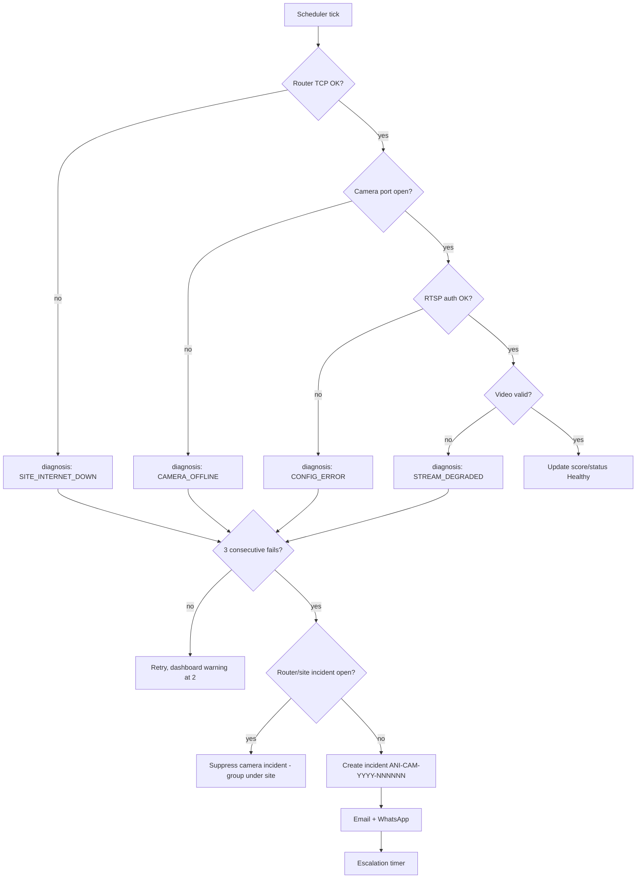
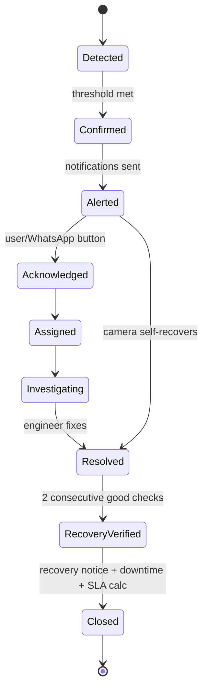
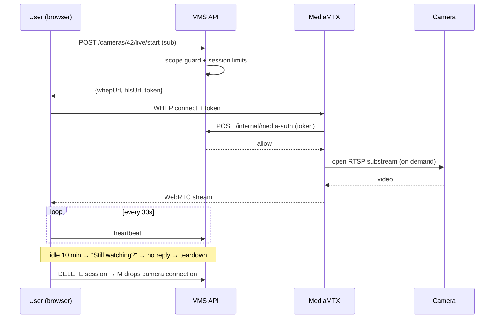
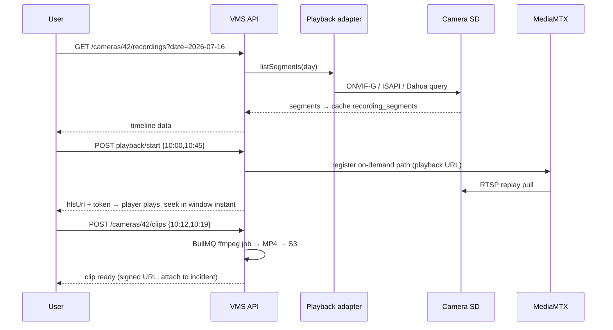
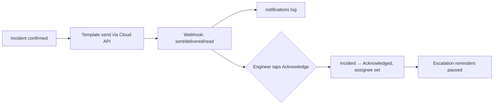
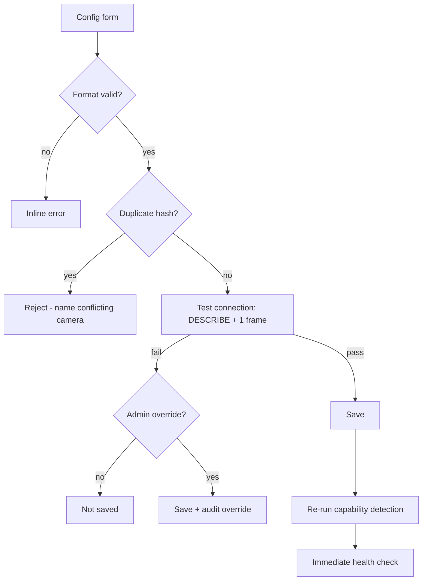
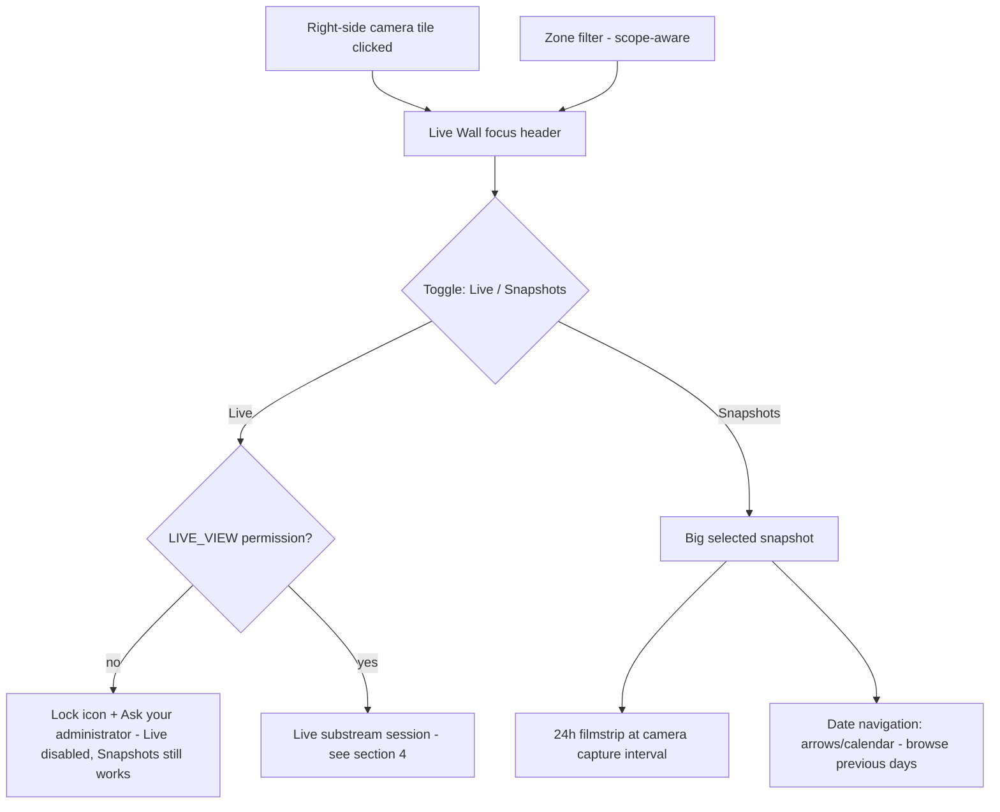
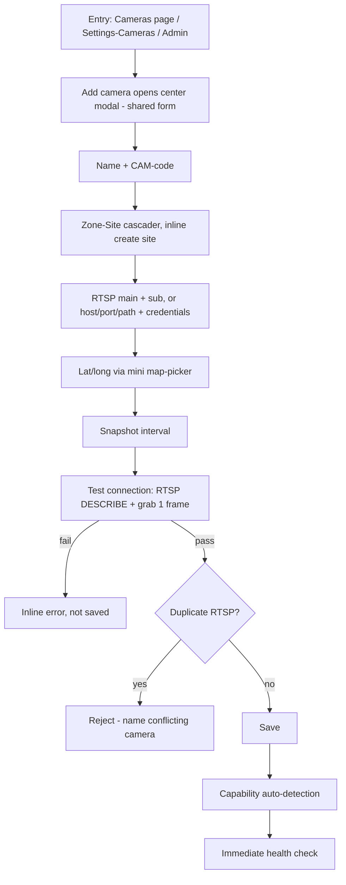
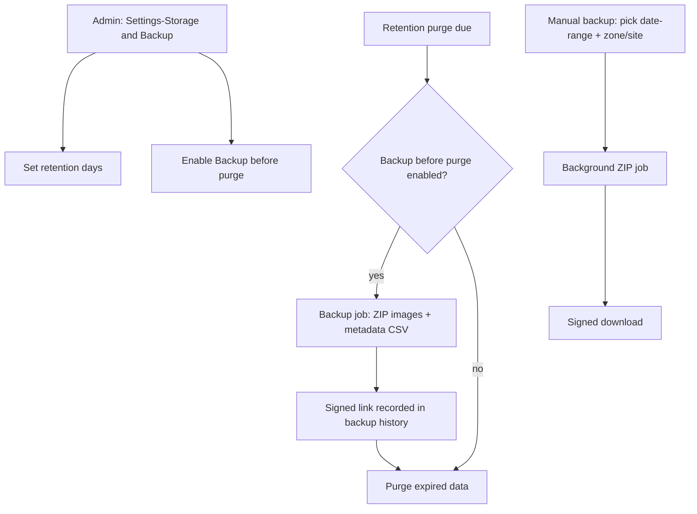
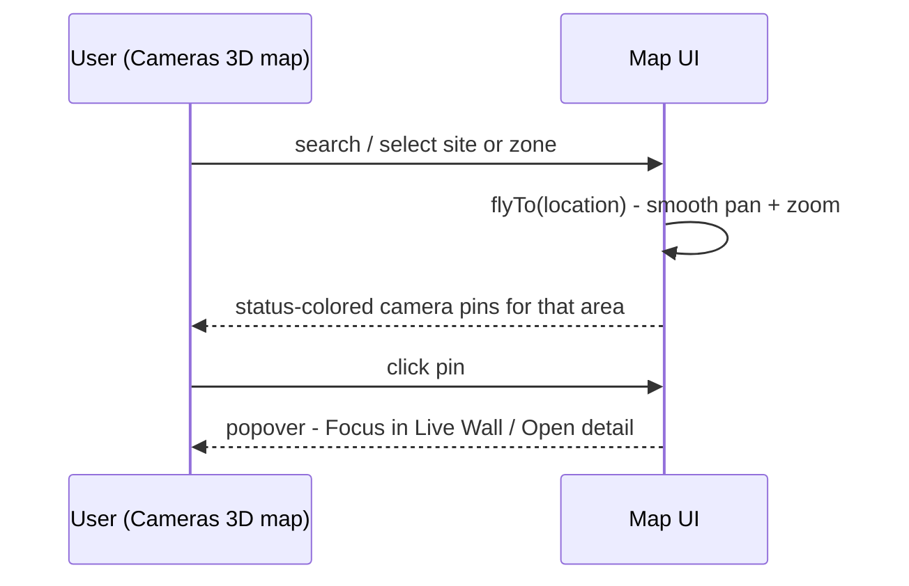

# Aniston VMS — App Flow

**Doc version: v1.1 · 18 July 2026 · Built for plan v1.5**

---

## 1. Role journeys (summary)

- **Monitoring Operator (zone-scoped):** Login → zone dashboard → sees Warning/Critical cards → opens incident → reads diagnosis banner ("Internet/SIM down at site") → acknowledges → watches live to confirm → adds note.
- **Maintenance Engineer:** WhatsApp alert → taps **Acknowledge** → opens incident on mobile → visits site → resolves → platform auto-verifies recovery (2 good checks) → recovery notification → downtime recorded.
- **Project Admin:** Creates a new site under Rohini → registers router + cameras → RTSP "Test connection" → capability auto-detected → cameras go live in monitoring within one cycle.
- **Client Viewer:** Read-only zone dashboard → monthly uptime & SLA report → snapshot evidence.

## 2. Health check → incident

## 3. Incident lifecycle

Escalation while unresolved: **0 min** engineer → **10** reminder → **20** PM → **30** ops head → **60** senior mgmt/client. Ack pauses reminders (policy-dependent) but the fault stays visible; escalation stops on recovery, maintenance mode, merge into site outage, or authorized closure.

## 4. Live view session

Wall = 4–6 parallel substream sessions (2×2 / 3×2), each tile its own session with auto-reconnect.

## 5. Playback + clip export

## 6. WhatsApp acknowledge

Read receipts never auto-resolve incidents.

## 7. RTSP save with validation

## 8. Zone / camera move

Select camera → "Move to…" (zone→site picker, scope-checked) → confirmation dialog showing impact (location, alert routing, open incidents follow) → audit entry → dashboards, wall layouts, and reports reflect the new zone immediately; historical incidents keep their original `zone_id`.

## 9. Live ⇄ Snapshot toggle (permission-gated)

Note (v1.5 shell): topbar is reduced to notification bell + "Open Live Wall" button; the Live/Snapshots toggle and zone filter live in the focus header itself, not the topbar.

## 10. Add-camera modal flow

Note (v1.5 shell): the dashboard's dashed "Add camera" card is retired; this modal is now the single entry point, shared across Cameras, Settings→Cameras, and Admin, and reuses the same form/validation described in section 7 (RTSP save with validation).

## 11. Backup-before-purge flow

## 12. Map search → flyTo

## 13. Zone click navigation

Clicking a sidebar zone, or a dashboard zone card, opens `/zones/:id` — a populated zone page (KPIs, sites, cameras, open incidents, uptime). Same destination regardless of entry point; scope-checked like all zone-scoped views.

Note (v1.5 shell): user profile now lives at the sidebar bottom (moved from the topbar); the sidebar zone list remains the primary nav entry point into zone pages.
