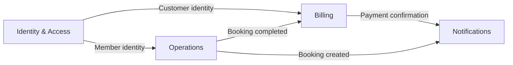

# Skill — DDD Bounded Contexts Patterns

For apps with > 10 entities where a single design becomes unreadable. Splits
the app into bounded contexts, each with its own vocabulary, its own
persistence, and its own team-of-agents.

Complements `skill-domain-modeling-patterns.md` (which covers tactical DDD
inside a context — aggregates, value objects, repositories).

---

## When to split into bounded contexts

Split when TWO of these are true:

1. The RBAC matrix has > 20 resource-action cells (`shared/permissions.ts`)
2. The Prisma schema has > 12 models
3. Two roles use the same word to mean different things ("Customer" = who?)
4. Two workflows share entity names but not entity IDs (a `Booking` in
   billing ≠ a `Booking` in operations)

Do NOT split when only ONE is true. Premature splitting adds more coordination
cost than it saves.

---

## Pattern — Context map (Mermaid)

Draw the contexts as bubbles, the relationships as arrows.

````markdown

````

Relationship types (label the arrow):
- `Customer/Supplier` — upstream context provides data, downstream depends on it
- `Conformist` — downstream accepts upstream's model as-is
- `Anti-Corruption Layer (ACL)` — downstream translates to protect its own model
- `Shared Kernel` — both contexts share a small strictly-versioned schema
- `Open Host Service` — upstream publishes a stable API to many consumers
- `Partnership` — mutual dependency, coordinated release

---

## Pattern — Ubiquitous language table (per context)

The same word means different things in different contexts. Name it.

```markdown
| Word | IAM meaning | Billing meaning | Operations meaning |
|---|---|---|---|
| Customer | Person with a User account | Party we invoice | Person we serve |
| Account | Login credential set | Billing profile | — |
| Balance | — | Amount owed | — |
| Order | — | Line item on invoice | Service booking |
```

Rows help freshers stop naming a Billing entity `Customer` when they mean
`InvoiceRecipient`.

---

## Pattern — File-tree layout for bounded contexts

Bounded contexts map to **modules** in this boilerplate:

```
backend/src/modules/
  iam/                       ← Identity & Access context
    user/                    ← subdomain within IAM
    session/
    permission/
  billing/                   ← Billing context
    invoice/
    payment/
    subscription/
  operations/                ← Operations context
    booking/
    resource/
    schedule/
```

**Cross-context calls** happen through domain events or an explicit ACL — not
by importing another context's Prisma types.

---

## Pattern — Anti-Corruption Layer (ACL)

Guards a context from an upstream's shape. Downstream defines its own type,
translates on the boundary.

```typescript
// backend/src/modules/billing/acl/iamAdapter.ts

// Billing's OWN model of what a customer is
export interface BillingCustomer {
  id: string;
  displayName: string;
  invoiceEmail: string;
  billingAddressLine: string;
}

// Translate from IAM's User model — never import User type into billing/*
import type { User as IamUser } from '@prisma/client';

export function toBillingCustomer(iamUser: IamUser & { billingProfile: any }): BillingCustomer {
  return {
    id: iamUser.id,
    displayName: iamUser.fullName,
    invoiceEmail: iamUser.billingProfile?.email ?? iamUser.email,
    billingAddressLine: iamUser.billingProfile?.address ?? '',
  };
}
```

**Rule:** every Billing service that needs customer data uses `toBillingCustomer`
— never accesses `iamUser.fullName` directly. IAM can change its user shape
without breaking Billing.

---

## Pattern — Domain events for cross-context communication

Contexts talk via typed events, not method calls.

```typescript
// shared/src/events/operationsEvents.ts
export type BookingCompletedEvent = {
  type: 'BookingCompleted';
  bookingId: string;
  organizationId: string;
  customerId: string;
  amountCents: number;
  completedAt: Date;
};
```

Operations publishes:

```typescript
// backend/src/modules/operations/booking/booking.service.ts
await outbox.store(tx, {
  aggregateId: booking.id,
  aggregateType: 'Booking',
  eventType: 'BookingCompleted',
  payload: bookingCompletedEvent,
  organizationId: actor.organizationId,
});
```

Billing subscribes:

```typescript
// backend/src/modules/billing/handlers/onBookingCompleted.ts
export async function onBookingCompleted(event: BookingCompletedEvent) {
  await BillingService.createInvoiceForCompletedBooking(event);
}
```

See `skill-workflow-orchestration-patterns.md` for the outbox + worker
plumbing.

---

## Pattern — Naming and folder rules

- Context folder = kebab-case business term. `iam`, not `identity_access`.
- Subdomain folder inside a context = kebab-case business noun. `booking`, not
  `booking-service`.
- No shared model imports across context boundaries. Use ACL or event.
- One `permissions.ts` entry per resource per context: `iam.users`,
  `billing.invoices`, `operations.bookings`.
- Migrations named with context prefix: `20260707_billing_add_invoice.sql`.

---

## Pattern — When NOT to use DDD

- App < 8 entities. Skip bounded contexts entirely.
- Solo developer, throwaway prototype, < 6-month product life. Skip DDD tactical too.
- No clear vocabulary conflict. If everyone means the same "Customer", don't split.

---

## Checklist

- [ ] Context map drawn (Mermaid) with labeled relationships
- [ ] Ubiquitous language table has ≥ 3 words that mean different things
      across contexts (else you don't need contexts)
- [ ] Each context has its own module folder in `backend/src/modules/`
- [ ] No context imports another context's Prisma types directly (ACL only)
- [ ] Cross-context communication uses domain events + outbox (never direct
      method calls)
- [ ] Permission resource keys are prefixed with context name
      (`iam.users`, not just `users`)
- [ ] Each context has its own team-of-agents ownership documented in the
      ADR (who's on-call for billing? who reviews operations?)
