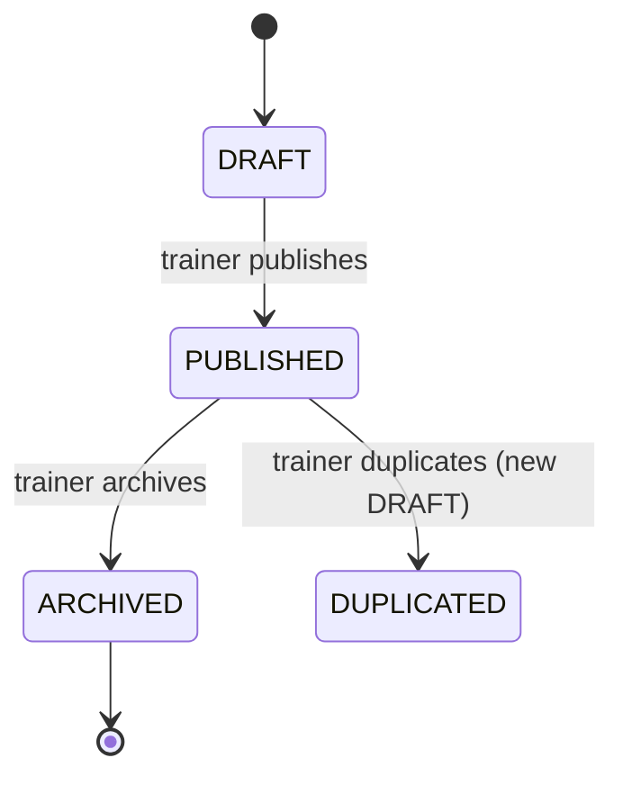

# Skill — System Design Patterns

Templates for every section of a system-design document. Used by
`agent-system-designer` to produce `memory/decisions/ADR-*-system-design-*.md`,
`docs/prd-*.md`, and `docs/erd-*.md`.

Rule: every section stays under 30 lines. Long specs rot faster than they
inform.

---

## Template 1 — Actors table

Two columns, one row per role. Do not extend to 5 columns.

```markdown
| Role | Primary action |
|---|---|
| Admin | Configure workspace, manage users |
| Trainer | Publish workout programs, review client progress |
| Client | Log workouts, view program, message trainer |
| Anonymous visitor | Browse public programs, sign up |
```

**Rule:** if you have > 6 roles, you don't have a design — you have HR-org
sprawl. Collapse first.

---

## Template 2 — Core entities table

```markdown
| Entity | Scope | Encrypted fields | Notes |
|---|---|---|---|
| Workout | org | — | Immutable after publish |
| WorkoutSession | user | — | Time-series, kept 5y |
| BodyMetric | user | `weightEncrypted` | Sensitive PII |
| Payment | user | `cardTokenEncrypted` | Third-party gateway ref only |
```

**Rule:** every entity's scope is explicit — `org` / `user` / `global`. If
you can't decide, it's `org`.

---

## Template 3 — State machine (rough)

Mermaid state diagram is best. Below is a canonical shape.

````markdown

````

Below the diagram:

- Terminal states: `ARCHIVED`
- Self-transitions: none
- Concurrency: `updateMany` with `where: { id, status: 'DRAFT' }` for optimistic lock
- Side effects on `PUBLISHED`: notify subscribed clients, emit socket event, audit log
- Rollback: `DRAFT -> PUBLISHED -> DRAFT` is NOT allowed; use `DUPLICATED` instead

Pair with `skill-state-machine-patterns.md` for the code shape.

---

## Template 4 — API contract table

```markdown
| Method | Path | Purpose | Middleware chain |
|---|---|---|---|
| POST | `/api/workouts` | Create draft workout | `authenticate` → `requirePermission('workouts','create')` → `validateRequest` |
| GET | `/api/workouts` | List workouts | `authenticate` → `requirePermission('workouts','read')` → `validateRequest` |
| PATCH | `/api/workouts/:id/publish` | Transition to published | `authenticate` → `requirePermission('workouts','update')` → `validateRequest` |
| WS | `workout.published` | Broadcast on publish | `authenticate` (via socket handshake) |
```

**Rule:** every route uses the 2-arg `requirePermission(resource, action)`
form. If you list `workouts.publish` as a permission, register it in
`shared/src/permissions.ts` before writing the route.

---

## Template 5 — Screens inventory

```markdown
| Screen | Route | RBAC | Priority |
|---|---|---|---|
| Login | `/login` | anon | P0 |
| Signup / onboarding | `/onboarding?step=N` | anon | P0 |
| Dashboard | `/` | any | P0 |
| Workout list | `/workouts` | any | P0 |
| Workout detail | `/workouts/:id` | any (own) / trainer (all) | P1 |
| Program builder | `/programs/:id/edit` | trainer | P1 |
| Settings — Profile | `/settings/profile` | any (own) | P1 |
| Settings — Team | `/settings/team` | admin | P2 |
| Billing | `/billing` | admin | P2 |
```

**Rule:** P0 must ship in v1. P1 within 2 sprints. P2 named but scheduled
later. Anything unrated goes to `Q8 — Explicitly out of scope`.

---

## Template 6 — RBAC matrix

```markdown
| Resource / Action | admin | trainer | client | anon |
|---|---|---|---|---|
| workouts.read | ✓ | ✓ | ✓ | — |
| workouts.create | — | ✓ | — | — |
| workouts.update | ✓ | ✓ (own) | — | — |
| workouts.delete | ✓ | ✓ (own, draft only) | — | — |
| users.read | ✓ | ✓ (own team) | ✓ (self) | — |
| users.create | ✓ | — | — | ✓ (self signup) |
| payments.read | ✓ | ✓ (own) | ✓ (own) | — |
```

**Rule:** this table becomes `shared/src/permissions.ts` verbatim.

---

## Template 7 — Non-functional requirements

Numeric, not vibes.

```markdown
- **Users at launch:** 100 concurrent (v1) → 10 000 (v2)
- **Latency budget:** p95 < 400ms for reads, < 1500ms for mutations
- **Uptime target:** 99.5 % (v1), 99.9 % (v2)
- **Data residency:** India (Mumbai region)
- **Compliance:** India DPDP applies (PII encryption at rest)
- **Offline:** PWA read-cache for last-viewed lists; no offline writes
- **Payments:** Razorpay (India), Stripe deferred to v2
- **Search:** Postgres FTS enough for < 100k records; upgrade to Meilisearch above
- **Backups:** Daily automated Postgres dump to S3, 30-day retention
```

**Rule:** if any bullet reads "TBD" or "we'll see", the design isn't done.

---

## Template 8 — Explicitly out of scope for v1

The MOST important section. Names the "later" pile.

```markdown
- **Multi-tenant billing** — one org per account for v1
- **Native mobile app** — PWA only; Capacitor wrap in v2
- **i18n** — English-India only in v1; en-US + hi in v2
- **Team collaboration on programs** — trainers work solo in v1
- **Analytics dashboards** — basic KPI card in v1; deep dashboards in v2
- **API for third parties** — internal only in v1
```

---

## Template 9 — Consequences (in ADR)

Ends with the "so what" section.

```markdown
## Consequences

- **Files to scaffold (P0):**
  - `prisma/schema.prisma` — add Workout, WorkoutSession
  - `backend/src/modules/workout/` — full MVC module
  - `frontend/src/features/workout/` — list + detail + create
  - `shared/src/permissions.ts` — add `workouts` row

- **Skills most relevant:**
  - `skill-mvc-patterns.md`, `skill-prisma-patterns.md`
  - `skill-state-machine-patterns.md` (workflow status)
  - `skill-search-filter-patterns.md` (workout listing)
  - `skill-form-patterns.md` (create/edit)

- **MCP servers beyond core 4:** `playwright` (for /build-loop E2E)

- **Estimated first-feature cost:** ~120k tokens per `/build-loop` invocation
  (based on the module size and 5-iteration cap). See
  `.claude/proxy-recommended.md` if this feels expensive.

- **Follow-up work:** update this ADR's Screens and Core entities sections
  after each `/new-module` if the shape grew unexpectedly.
```

---

## What NEVER to write in a system design

- Implementation details of a specific library ("use lodash.throttle"). Belongs in a skill file, not the design.
- Long prose paragraphs. Tables + bullets. Always.
- Made-up numeric NFRs. If you don't know, ask; don't guess "99.999%".
- Wishlist items. If it's not in v1, it goes in "Explicitly out of scope".
- Rebase-worthy commits ("we might switch to MongoDB"). If uncertain, resolve first with a decision doc — don't leave the ADR ambiguous.

---

## Checklist

- [ ] All 8 sections filled in the ADR (no "TBD"s)
- [ ] Every entity has explicit scope (org / user / global)
- [ ] Every state machine has explicit terminal states and rollback rules
- [ ] Every API row uses 2-arg `requirePermission(resource, action)` form
- [ ] RBAC matrix rows match `shared/src/permissions.ts` structure
- [ ] NFRs are numeric — no vibes
- [ ] "Explicitly out of scope" section is non-empty (this is the sign of a
      real design)
- [ ] ADR filename follows `ADR-NNNN-system-design-<slug>.md` convention
- [ ] Mermaid diagrams render (paste into mermaid.live to verify)
