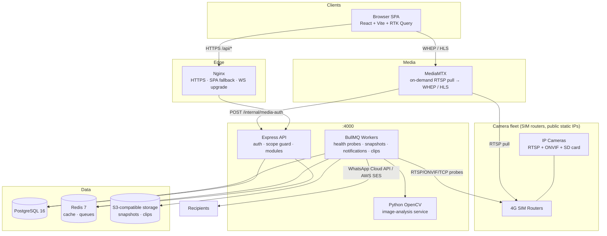
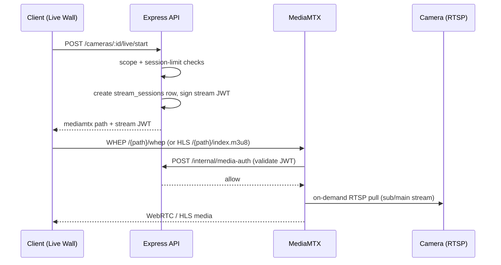
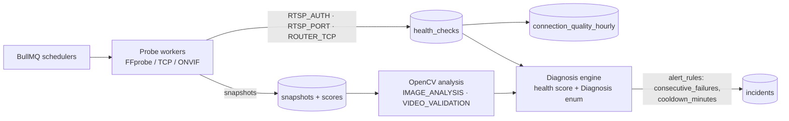
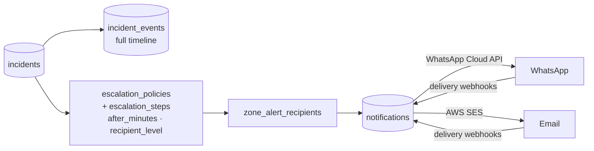
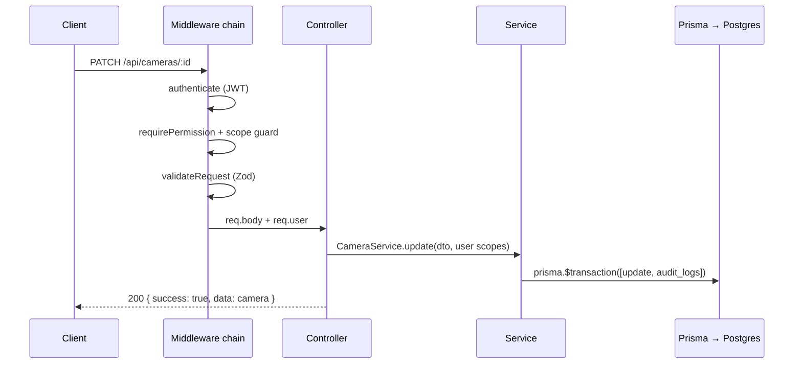

# System Architecture — Aniston VMS

> Source of truth: [`02-TRD.md`](02-TRD.md) (design) and [`05-backend-schema.md`](05-backend-schema.md)
> (data model). This doc is the working summary. Harness entry point: [`.claude/GUIDE.md`](../.claude/GUIDE.md).

## High-level overview

## Streaming path (live)

From `02-TRD.md`:

> Flow: `POST /cameras/:id/live/start` → scope + session-limit checks → create `stream_sessions`
> row → short-lived stream JWT → client plays WHEP (`/{path}/whep`) or HLS (`/{path}/index.m3u8`)
> → MediaMTX calls our `POST /internal/media-auth` webhook to validate the JWT per connection.

Playback follows the same session/auth model, with per-brand `PlaybackAdapter`s
(`ONVIF_G | HIKVISION | DAHUA | NONE`) reading SD-card recordings; discovered segments are
indexed in `recording_segments`, exports go through `clip_exports`.

## Health-check pipeline

- Check types (`CheckType`): `RTSP_AUTH`, `RTSP_PORT`, `ROUTER_TCP`, `IMAGE_ANALYSIS`, `VIDEO_VALIDATION`.
- Snapshot scoring: brightness / blur / freeze / obstruction / scene-shift (see `05-backend-schema.md § Monitoring`).
- Diagnosis (`Diagnosis`): e.g. `SITE_INTERNET_DOWN`, `SIM_SIGNAL_ISSUE`, `NETWORK_UNSTABLE`,
  `CAMERA_OFFLINE`, `STREAM_DEGRADED`, `IMAGE_PROBLEM`, `CONFIG_ERROR`.
- Camera state: `CameraStatus` + `health_score` on `cameras`, rolled up to site/zone/region dashboards.

## Incident & notification pipeline

- Incident lifecycle (`IncidentStatus`): `DETECTED → CONFIRMED → ALERTED → ACKNOWLEDGED →
  ASSIGNED → INVESTIGATING → …` (terminal states incl. resolution/recovery verification — see schema doc).
- Delivery tracking (`NotificationStatus`): `QUEUED | ACCEPTED | SENT | DELIVERED | READ | BOUNCED | FAILED`.
- Maintenance: `maintenance_windows` suppress alerts; `maintenance_tasks`
  (`TaskType`/`TaskSource`/`TaskStatus`) track field work like lens cleaning.

## Authentication & scoping

- JWT **access + refresh** (access short-lived in `Authorization` header, refresh in httpOnly
  cookie), MFA (TOTP) for admins, session expiry, login rate limiting (per `02-TRD.md § Security`).
- RTSP credentials stored **AES-256-GCM encrypted** (`rtsp_url_enc`, …); key from env; decrypted
  only in workers; masked everywhere in UI/API.
- **Access scoping** — every user carries `user_access_scopes` rows
  (`scope_type: ALL | REGION | ZONE | SITE`). Every query on hierarchy-scoped data must be
  filtered through the scope guard (this is the VMS application of the harness rule
  `rule-security-rbac.md`; roles: `SUPER_ADMIN`, `PROJECT_ADMIN`, … `CLIENT_VIEWER` — full enum in
  `05-backend-schema.md`).
- `audit_logs` row on every mutation.

## Request lifecycle (API)

## Job & retention architecture

Queues/workers (BullMQ on Redis): health probes, snapshot capture + analysis, notification
dispatch, clip export, segment discovery. Nightly workers (per `05-backend-schema.md § Retention & jobs`):
prune `snapshots` per policy (skip incident-linked), expire `recording_segments` cache > 35 d,
close stale `stream_sessions`, roll `connection_quality_hourly`; S3 lifecycle rules mirror DB policy.
