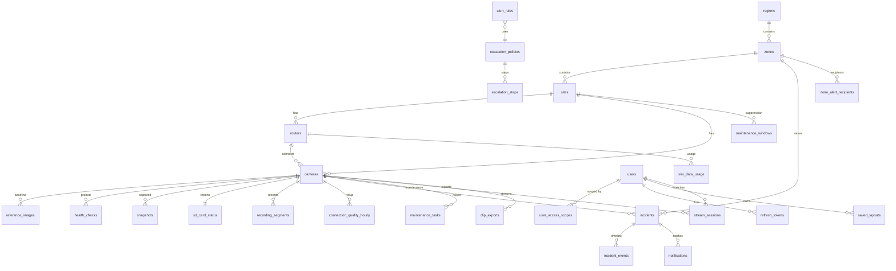

# Database — ERD (Aniston VMS)

> Generated from [`05-backend-schema.md`](05-backend-schema.md) — **that doc is the source of
> truth** for every table, column, enum and index. This is the orientation summary. Regenerate
> this file whenever `05-backend-schema.md` (or the real `prisma/schema.prisma`, once Stage 1
> lands) changes — `/graph` / `python -m graphify update .` gives the live structure afterwards.

Conventions (per schema doc): PostgreSQL 16, Prisma-style; all tables have `id uuid pk,
created_at, updated_at` unless noted; timestamps UTC; sensitive RTSP credentials stored
AES-256-GCM encrypted (`*_enc` columns); enums mirrored in `shared/src/`.

---

## Tables by domain (28 total)

### Identity & access
| Table | Purpose / key fields |
|---|---|
| `users` | `email @unique`, `password_hash`, `role Role`, `mfa_secret?`, `mfa_enabled`, `is_active`, `last_login_at` |
| `user_access_scopes` | `user_id → users`, `scope_type ScopeType`, `scope_id uuid?` (null when `ALL`) — hierarchy scoping |
| `refresh_tokens` | `user_id`, `token_hash @unique`, `expires_at`, `revoked_at?` |
| `audit_logs` | `user_id?`, `action`, `entity_type`, `entity_id`, `old_value/new_value Json?`, `ip_address` — indexed on `[user_id]`, `[entity_type, entity_id]`, `[created_at]` |

### Hierarchy & devices
| Table | Purpose / key fields |
|---|---|
| `regions` | `name @unique` ("North" …), `status` |
| `zones` | `region_id → regions`, `name` (`@@unique([region_id, name])`), lat/long |
| `sites` | `zone_id → zones`, `name`, `address`, lat/long, `client_id?`, `status` |
| `routers` | `site_id → sites`, `serial_number`, `imei`, `sim_number`, `operator`, `public_static_ip`, … |
| `cameras` | `site_id`, `router_id`, `camera_code @unique` ("CAM-042"), encrypted RTSP URLs, `playback_adapter PlaybackAdapter`, `status CameraStatus`, `health_score`, `diagnosis Diagnosis?` — indexed on `[site_id]`, `[status]` |
| `reference_images` | `camera_id → cameras`, `s3_key`, `approved_by → users`, `approved_at` — baseline for scene-shift |

### Monitoring
| Table | Purpose / key fields |
|---|---|
| `health_checks` | `camera_id`, `check_type CheckType`, `started_at/completed_at?`, `success`, latency + error fields — `@@index([camera_id, started_at])` |
| `connection_quality_hourly` | `camera_id`, `hour`, `success_rate`, `median_latency_ms`, … (`@@unique`-style per camera+hour rollup) |
| `snapshots` | `camera_id`, `captured_at`, `kind (SUB\|EVIDENCE)`, `original_key`/`thumbnail_key`, quality scores (brightness/blur/freeze/obstruction/scene-shift), analysis result — `@@index([camera_id, captured_at])` |
| `sd_card_status` | `camera_id @unique`, `present`, `capacity_gb?`, `free_gb?`, `recording_enabled?` |
| `recording_segments` | `camera_id`, `source ("sd_card")`, `track (MAIN\|SUB)`, `start_at`, `end_at`, `discovered_at` — `@@index([camera_id, start_at])` |
| `sim_data_usage` | `router_id`, `period`, `bytes_used`, `budget_bytes?` |

### Incidents & alerting
| Table | Purpose / key fields |
|---|---|
| `incidents` | `incident_number @unique` ("ANI-CAM-2026-000145"), `camera_id?`, `site_id`, `zone_id` (snapshotted), `severity Severity`, `status IncidentStatus`, detection/ack/resolution timestamps, `escalation_level`, root-cause fields — indexed on `[status]`, `[zone_id, first_detected_at]` |
| `incident_events` | `incident_id`, `actor?`, `event`, `detail Json?` — full timeline, `@@index([incident_id])` |
| `alert_rules` | `name`, `condition Json`, `severity`, `consecutive_failures`, `cooldown_minutes`, `escalation_policy_id?`, `enabled` |
| `escalation_policies` | `name`, `zone_id?` (null = default policy) |
| `escalation_steps` | `policy_id`, `after_minutes`, `recipient_level`, `channels Channel[]` |
| `zone_alert_recipients` | `zone_id`, `severity Severity`, `channel Channel`, `recipient`, `escalation_level` |
| `notifications` | `incident_id`, `channel Channel`, `recipient`, `template_name`, `provider_message_id?`, `status NotificationStatus`, delivery timestamps + failure reason |
| `maintenance_windows` | `site_id?`, `camera_id?`, `start_at`, `end_at`, `reason`, `approved_by → users` — alert suppression |
| `maintenance_tasks` | `camera_id`, `type TaskType`, `source TaskSource`, `status TaskStatus`, `assigned_to?` |

### Streaming & playback
| Table | Purpose / key fields |
|---|---|
| `stream_sessions` | `camera_id`, `user_id`, `kind StreamKind`, `mediamtx_path`, `started_at`, `ended_at?` — indexed on `[camera_id, ended_at]`, `[user_id]` |
| `clip_exports` | `camera_id`, `requested_by → users`, `start_at`, `end_at`, `status ClipStatus`, `s3_key?`, `size_bytes?` |
| `saved_layouts` | `user_id`, `name` (`@@unique([user_id, name])`), `layout LayoutKind`, `camera_ids Json` |

## Enums (mirror in `prisma/schema.prisma` AND `shared/src/`)

From `05-backend-schema.md § Enums` (full value lists there):
`Role` (SUPER_ADMIN, PROJECT_ADMIN, … CLIENT_VIEWER) · `ScopeType` (ALL/REGION/ZONE/SITE) ·
`CameraStatus` · `CheckType` (RTSP_AUTH, RTSP_PORT, ROUTER_TCP, IMAGE_ANALYSIS, VIDEO_VALIDATION) ·
`Diagnosis` (SITE_INTERNET_DOWN, SIM_SIGNAL_ISSUE, NETWORK_UNSTABLE, CAMERA_OFFLINE,
STREAM_DEGRADED, IMAGE_PROBLEM, CONFIG_ERROR, …) ·
`IncidentStatus` (DETECTED, CONFIRMED, ALERTED, ACKNOWLEDGED, ASSIGNED, INVESTIGATING, …) ·
`Severity` · `Channel` · `NotificationStatus` (QUEUED, ACCEPTED, SENT, DELIVERED, READ, BOUNCED, FAILED) ·
`StreamKind` (LIVE_SUB, LIVE_MAIN, PLAYBACK) · `PlaybackAdapter` (ONVIF_G, HIKVISION, DAHUA, NONE) ·
`ClipStatus` (QUEUED, PROCESSING, DONE, FAILED) · `TaskType` (LENS_CLEANING, …) ·
`TaskSource` (AUTO/MANUAL) · `TaskStatus` · `LayoutKind`

## Relationship diagram

## Retention & seeds

Nightly workers: prune `snapshots` per policy (skip incident-linked), expire `recording_segments`
cache > 35 d, close stale `stream_sessions`, roll `connection_quality_hourly`; S3 lifecycle rules
mirror DB policy. **Seeds:** 4 regions, 13 zones (Delhi structure), 2 demo sites, 2 routers,
6 simulator cameras (`playback_adapter=ONVIF_G`), default alert rules matrix, default escalation
policy, one admin user.
